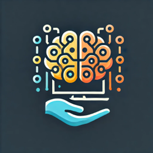

# DATAMIND - PI FATEC ARARAS 2 SEMESTRE

## Estrutura de pasta do projeto

# pi_2_semestre

* [assets/](.\pi_2_semestre\assets)
* [docs/](.\pi_2_semestre\docs)
  * [database/](.\pi_2_semestre\docs\database)
    * [PI-2-SEM.brM3](.\pi_2_semestre\docs\database\PI-2-SEM.brM3)
    * [PI-2-SEM.png](.\pi_2_semestre\docs\database\PI-2-SEM.png)
  * [design/](.\pi_2_semestre\docs\design)
    * [Screens/](.\pi_2_semestre\docs\design\Screens)
    * [logo-nossa-empresa.png](.\pi_2_semestre\docs\design\logo-nossa-empresa.png)
    * [logo-original.jpg](.\pi_2_semestre\docs\design\logo-original.jpg)
  * [diagrams/](.\pi_2_semestre\docs\diagrams)
    * [DIAG-CLA01.jpg](.\pi_2_semestre\docs\diagrams\DIAG-CLA01.jpg)
    * [DIAG-SEQ02.jpg](.\pi_2_semestre\docs\diagrams\DIAG-SEQ02.jpg)
    * [DIAG-SEQ03.jpg](.\pi_2_semestre\docs\diagrams\DIAG-SEQ03.jpg)
    * [DIAG-SEQ04.jpg](.\pi_2_semestre\docs\diagrams\DIAG-SEQ04.jpg)
    * [DIAG-UC01.jpg](.\pi_2_semestre\docs\diagrams\DIAG-UC01.jpg)
    * [Diagrama.sequencia.estoque.jpg](.\pi_2_semestre\docs\diagrams\Diagrama.sequencia.estoque.jpg)
    * [diagrama_sequencia.login1.jpg](.\pi_2_semestre\docs\diagrams\diagrama_sequencia.login1.jpg)
    * [diagrama_sequencia.login2.jpeg](.\pi_2_semestre\docs\diagrams\diagrama_sequencia.login2.jpeg)
    * [diagrama_sequencia.login3.jpg](.\pi_2_semestre\docs\diagrams\diagrama_sequencia.login3.jpg)
    * [driagrama_sequencia.cadastro1.png](.\pi_2_semestre\docs\diagrams\driagrama_sequencia.cadastro1.png)
    * [README.md](.\pi_2_semestre\docs\diagrams\README.md)
  * [entrevistas/](.\pi_2_semestre\docs\entrevistas)
    * [01_10_2024-PERGUNTAS_PARA_CLIENTE.pdf](.\pi_2_semestre\docs\entrevistas\01_10_2024-PERGUNTAS_PARA_CLIENTE.pdf)
  * [1-CRONOGRAMA - cronograma.pdf](.\pi_2_semestre\docs\1-CRONOGRAMA - cronograma.pdf)
  * [1-CRONOGRAMA.xlsx](.\pi_2_semestre\docs\1-CRONOGRAMA.xlsx)
  * [DOCUMENTAÇÃO_PROJETO_14-10-2024.docx](.\pi_2_semestre\docs\DOCUMENTAÇÃO_PROJETO_14-10-2024.docx)
  * [DOCUMENTAÇÃO_PROJETO_14-10-2024.pdf](.\pi_2_semestre\docs\DOCUMENTAÇÃO_PROJETO_14-10-2024.pdf)
  * [guide-for-commits.md](.\pi_2_semestre\docs\guide-for-commits.md)
* [html/](.\pi_2_semestre\html)
  * [agendamento.html](.\pi_2_semestre\html\agendamento.html)
  * [cadastro.html](.\pi_2_semestre\html\cadastro.html)
  * [dashboard.html](.\pi_2_semestre\html\dashboard.html)
  * [estoque.html](.\pi_2_semestre\html\estoque.html)
  * [login.html](.\pi_2_semestre\html\login.html)
* [js/](.\pi_2_semestre\js)
  * [estoque.js](.\pi_2_semestre\js\estoque.js)
  * [navbar.js](.\pi_2_semestre\js\navbar.js)
  * [script.js](.\pi_2_semestre\js\script.js)
* [php/](.\pi_2_semestre\php)
  * [classes/](.\pi_2_semestre\php\classes)
    * [agendamento.php](.\pi_2_semestre\php\classes\agendamento.php)
    * [conexao.php](.\pi_2_semestre\php\classes\conexao.php)
    * [estoque.php](.\pi_2_semestre\php\classes\estoque.php)
    * [paginacao.php](.\pi_2_semestre\php\classes\paginacao.php)
    * [query.php](.\pi_2_semestre\php\classes\query.php)
    * [usuario.php](.\pi_2_semestre\php\classes\usuario.php)
  * [ctr_agendamento.php](.\pi_2_semestre\php\ctr_agendamento.php)
  * [ctr_cadastro.php](.\pi_2_semestre\php\ctr_cadastro.php)
  * [ctr_dashboard.php](.\pi_2_semestre\php\ctr_dashboard.php)
  * [ctr_estoque.php](.\pi_2_semestre\php\ctr_estoque.php)
  * [ctr_login.php](.\pi_2_semestre\php\ctr_login.php)
  * [error_guide.md](.\pi_2_semestre\php\error_guide.md)
* [sql/](.\pi_2_semestre\sql)
  * [database.sql](.\pi_2_semestre\sql\database.sql)
* [style/](.\pi_2_semestre\style)
  * [agendamento.css](.\pi_2_semestre\style\agendamento.css)
  * [cadastro.css](.\pi_2_semestre\style\cadastro.css)
  * [estoque.css](.\pi_2_semestre\style\estoque.css)
  * [login.css](.\pi_2_semestre\style\login.css)
  * [style.css](.\pi_2_semestre\style\style.css)
* [.gitignore](.\pi_2_semestre\.gitignore)
* [agendamento.php](.\pi_2_semestre\agendamento.php)
* [cadastro.php](.\pi_2_semestre\cadastro.php)
* [dashboard.php](.\pi_2_semestre\dashboard.php)
* [estoque.php](.\pi_2_semestre\estoque.php)
* [index.php](.\pi_2_semestre\index.php)
* [logout.php](.\pi_2_semestre\logout.php)
* [README.md](.\pi_2_semestre\README.md)

Abaixo estão listadas todas as informações referente a este projeto integrador realizado na Fatec Araras referente ao 2 Semestre de 2024, contemplando as disciplinas e professores:

- Desenvolvimento Web 2 (Orlando Saraiva Júnior)
- Engenharia de Software 2 (Bruno Henrique de Paula Ferreira) **- Disciplina Chave**
- Banco de Dados 2 (Nilton Cesar Sacco)

## Nome, visão, missão e valores

#### 1 Missão

A empresa busca desenvolver soluções tecnológicas acessíveis
e intuitivas para pequenos negócios, potencializando a organização, a gestão e
experiência do pequeno empresário, aplicando conceitos de software apreendidos
durante a execução do atual projeto.

#### 1.2 Visão

Ser a principal escolha de software de gestão para
microempreendedores, oferecendo ferramentas simples e eficientes que ajudam a
automatizar suas operações e a crescer de forma sustentável, buscando em
primeiro lugar, a satisfação do atual cliente deste projeto e a expansão do
contato e influência.

#### 1.3 Valores

Os valores da empresa Datamind, contemplam:

- **Inovação** : Buscamos sempre soluções criativas e inovadoras.
- **Qualidade** : Oferecemos produtos que agregam valor e confiança.
- **Acessibilidade** : Tornamos a tecnologia acessível para micro e pequenos empreendedores.

## Logotipo

O logotipo da **Datamind** reflete os princípios de inovação e acessibilidade da empresa. Ele apresenta um cérebro estilizado, simbolizando inteligência, criatividade e tecnologia, elementos centrais para o desenvolvimento das soluções que a empresa oferece. A interligação de circuitos ao redor do cérebro remete à conectividade e à eficiência, demonstrando o foco em automação e organização para pequenos empreendedores. A mão estilizada abaixo do cérebro representa o suporte e a acessibilidade, evidenciando o compromisso da Datamind em fornecer soluções acessíveis e intuitivas, sempre ao alcance de seus clientes.

## Empresa do projeto

A empresa do projeto se localiza na cidade de Leme, SP. O ramo desta é rotisseria, ou seja, faz doces, massas, salgados, tudo sob encomenda. Conforme conversado com nossa cliente, o sistema busca resolver os seguintes itens:

- Estoque
- Agendamento

## Tecnologias Utilizadas

As tecnologias utilizadas no projeto envolvem as três matérias apresentadas anteriormente. Portanto, são as seguintes tecnologias:

## Tecnologias Utilizadas

As tecnologias utilizadas no projeto envolvem as três matérias apresentadas anteriormente. Portanto, são as seguintes tecnologias:

- **Banco de Dados:** MySQL 10.4.32-MariaDB 
- **Frontend:** HTML, CSS, JS, Bootstrap  
   
   
   
- **Backend:** PHP Version 8.2.12 
- **Codificação:** VSCode  
- **Prototipação / Design:** Figma
   
