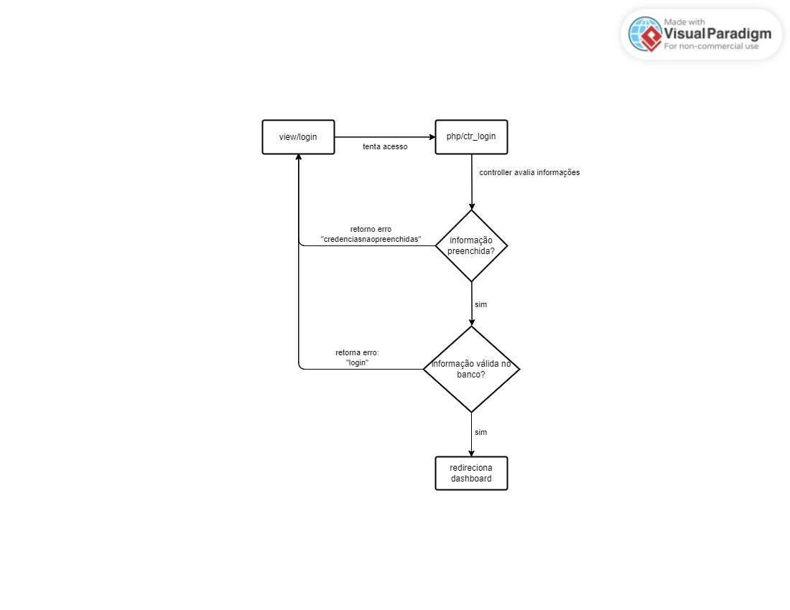

# Documentação técnica de código

> Última atualização: 15/11/2024

Este documentto contempla toda a documentação técnica de código

### Sumário

- [Processo Login](#1-processo-login)
- [Processo Dashboard](#2-processo-dashboard)


## 1. Processo Login

O processo de login envolve o frontend, controller e banco de dados para consulta das informações.

Diagrama de Fluxo Geral
<details>
    <summary>Visualizar diagrama.</summary>
    <h3>Diagrama de Fluxo de Login</h3> 
    <br><br>

</details>

Classes utilizadas no processo:
- Conexao
- Usuario

```
# Classe Usuario
    A resposbilidade da classe se destina em:
```
```
# Classe Conexao
    A resposbilidade da classe se destina em conectar, fechar e retornar erros com a conexão do banco de dados.
    No caso, sua utilização é justificada para reaproveitamento de código.
    Sua implementação ocorre por composição em outras classes.
```
<details>
    <summary>Explicação detalhada de código.</summary>
    Explicações:

    ```php
    // Será implementado.
    ```
    
</details>

## 2. Processo Dashboard

O processo de dashboard.