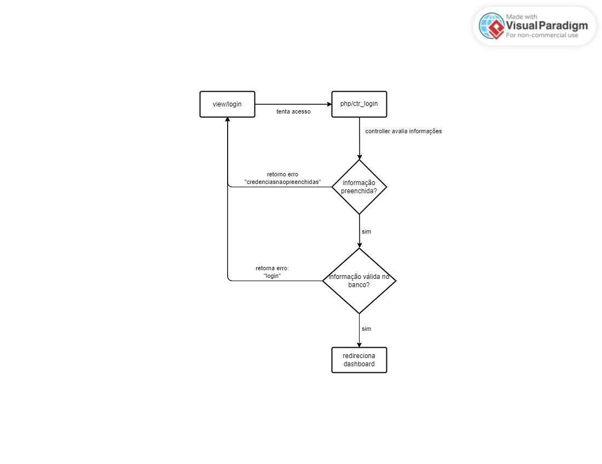
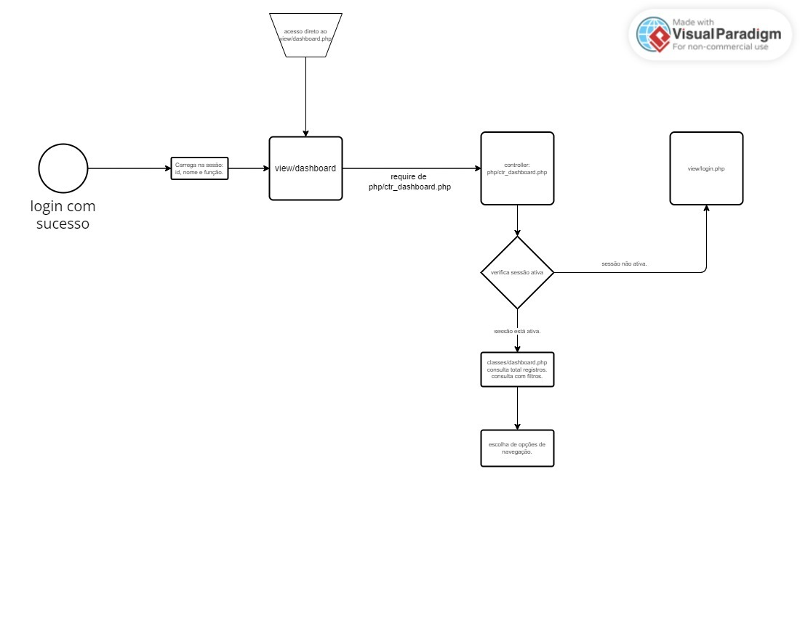

# Documentação técnica de código

> Última atualização: 15/11/2024

Este documentto contempla toda a documentação técnica de código

### Sumário

- [Processo Login](#1-processo-login)
- [Processo Dashboard](#2-processo-dashboard)
- [Processo Estoque](#3-processo-de-estoque)
- [Processo Agendamento](#4-processo-de-agendamento)
- [Processo Cadastrar Usuário](#5-processo-de-cadastro-de-usuário)


## 1. Processo Login

O processo de login envolve o frontend, controller e banco de dados para consulta das informações.

Diagrama de Fluxo Geral
<details>
    <summary>Visualizar diagrama.</summary>
    <h3>Diagrama de Fluxo de Login</h3> 
    <br><br>

</details>

Classes e arquivos utilizados no processo:
- Conexao
- Usuario
- Arquivo Session_check

```
# Classe Usuario
    A resposbilidade da classe se destina em:
    - Manipular consulta para login no banco de dados.
    - Instanciar por meio de getters informações do usuário para carregar na session.
```
```
# Classe Conexao
    A resposbilidade da classe se destina em conectar, fechar e retornar erros com a conexão do banco de dados.
    No caso, sua utilização é justificada para reaproveitamento de código.
    Sua implementação ocorre por composição em outras classes.
```
```
# Arquivo Session_check
   Verificação de sessão.
```
<details>
    <summary>Explicação detalhada de código.</summary>
    Explicações:

    ```php
    // Será implementado.
    ```
    
</details>

## 2. Processo Dashboard

O processo de dashboard envolve:

- Carregamento de informação do usuário logado (ctr_login.php).
- Classe Dashboard para filtros e dados de reotrno do banco.
- Classe paginação para criar a paginação na tela.
- Controller para centralizar as lógicas acima (incluindo verificação de sessão).

Diagrama de Fluxo Geral
<details>
    <summary>Visualizar diagrama.</summary>
    <h3>Diagrama de Fluxo de Dashboard</h3> 
    <br><br>

</details>

Classes e arquivos utilizados no processo:
- Dashboard
- Paginação
- Arquivo Session_Check

```
# Classe Dashboard
    A resposbilidade da classe se destina em:
    - Maniupular SQL para retornar informações de pesquisa.
    - Manipular SQL para retornar informações de status.
    - Manipular SQL para retornar quantidade de agendamentos com base em filtros e pesquisas.
```
```
# Classe Paginação
    A resposbilidade da classe se destina em:
    - Realizar cálculos e verificações de páginas, retornando os limites, intervalos e outros.
```
<details>
    <summary>Explicação detalhada de código.</summary>
    Explicações:

    ```php
    // Será implementado.
    ```
    
</details>

## 3. Processo de Estoque

## 4. Processo de Agendamento

## 5. Processo de Cadastro de Usuário

O processo de cadastro de usuário envolve:
- Verificação de sessão.
- Classe de cadastro do usuário no banco de dados.
- Validação de informações antes de cadastro.

Diagrama de Fluxo Geral
<details>
    <summary>Visualizar diagrama.</summary>
    <h3>Diagrama de Fluxo de Cadastro</h3> 
    <br><br>

</details>