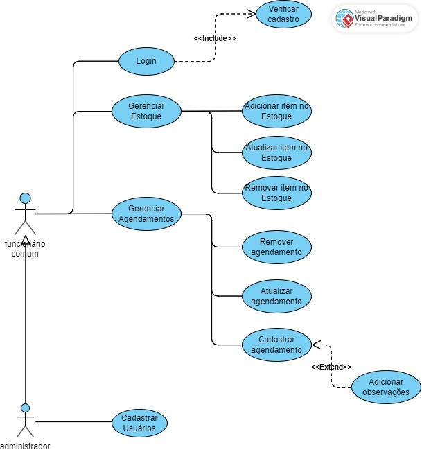
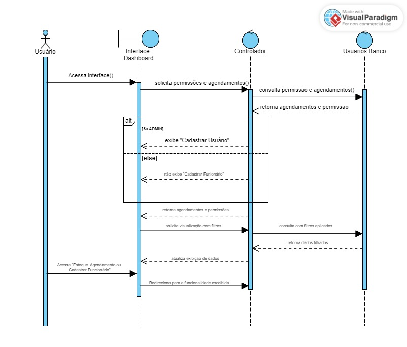
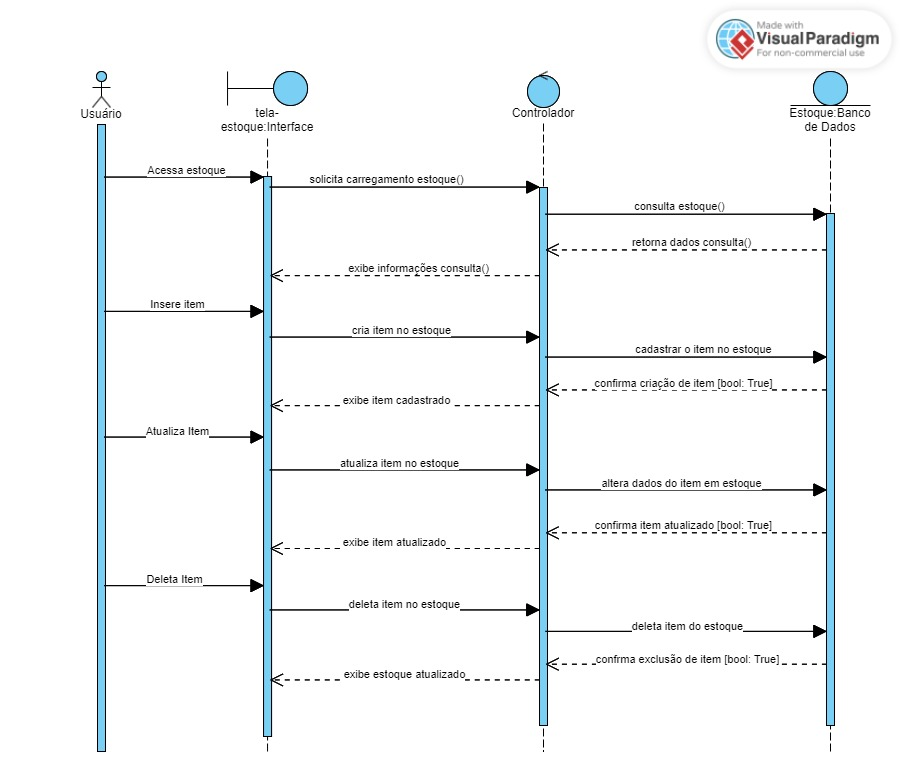
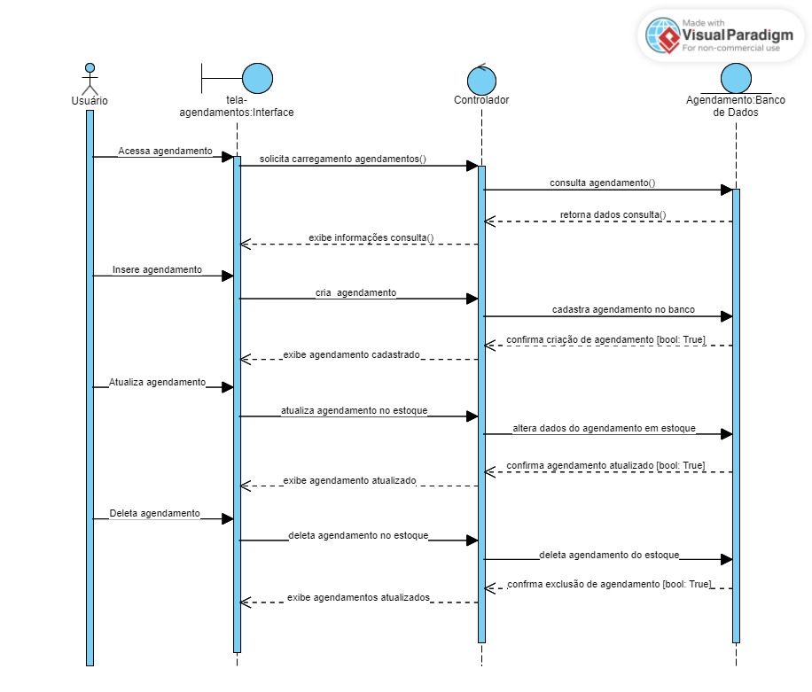

# Diagramas do Projeto

Este diretório apresenta os diagramas do projeto, dos quais se totalizam 4 diagramas e são obrigatórios:

- **Diagrama de Classe
- **Diagrama de Sequência
- **Diagrama de Caso de uso
- Diagrama de Atividades

Abaixo, segue anexado as imagens referente a cada diagrama.

### Diagrama de Caso de Uso

### Diagramas de Sequência
#### DIAG_SEQ01

#### DIAG_SEQ02

#### DIAG_SEQ03

#### DIAG_SEQ04
