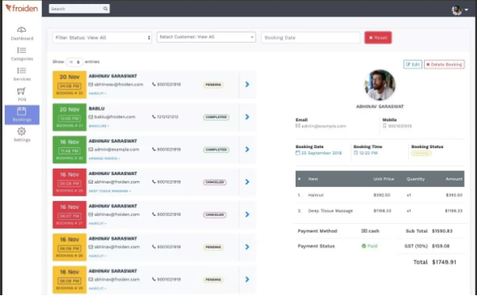

**TERCEIRA ENTREVISTA PARA LEVANTAMENTO DE REQUISITOS FUNCIONAIS E NÃO FUNCIONAIS**

\*\*Perguntas\*\*

O que é necessário para cadastrar, atualizar ou remover.

\*\*\*marcar outra reunião para discutir mais detalhadamente sobre.

Gerenciamento de agendamentos

- cadastro
- remover
- atualizar produto

\*\*Perguntas\*\*

O que é necessário para o agendamento, o que deseja ver?

dados para o agendamento.

nome completo

número de telefone

data de entrega

item - produto

horário retirada (precisa informar por exemplo, quando for retirar o bolo, é preferível finalizar por conta de alguns ingredientes, próximo ao horário de retirada)

observações

se atentar e considerar na modelagem a quantidade e quais ingredientes são incluídos na receita.

uma listagem tipo lista com todos os agendamentos aparecendo (mesmo que houver vários no mesmo dia)

opção de filtro para data de início e término

Ao clicar, exibir mais informações sobre o agendamento.

status de agendamento

finalizado

em progresso

**cancelar o agendamento.**

**botão para cancelamento e perguntar se deseja retirar itens do estoque.**

produto final ainda em estoque, mas os ingredientes já foram utilizados.

FICHA TÉCNICA 

CALCULAR O CUSTO DO PRODUTO - EXIBIR QUAIS INGREDIENTES TIVERAM.

TELA DE RECEITAS
